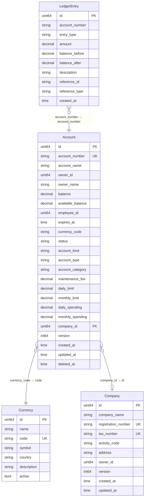

# account_db — ER Diagram

PostgreSQL, port 5435

> **Cross-DB references** (not enforced by FK constraints):
> - `Account.owner_id` → `client_db.clients.id` (personal accounts) or `company.owner_id` (corporate accounts)
> - `Account.employee_id` → `user_db.employees.id`
> - `Company.owner_id` → `client_db.clients.id`
