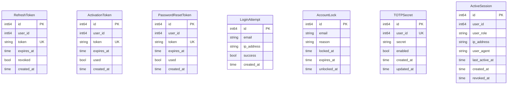

# auth_db — ER Diagram

PostgreSQL, port 5433

> **Cross-DB references** (not enforced by FK constraints):
> - `RefreshToken.user_id` → `user_db.employees.id` or `client_db.clients.id`
> - `ActivationToken.user_id` → `user_db.employees.id`
> - `PasswordResetToken.user_id` → `user_db.employees.id`
> - `TOTPSecret.user_id` → `user_db.employees.id`
> - `ActiveSession.user_id` → `user_db.employees.id` or `client_db.clients.id`
