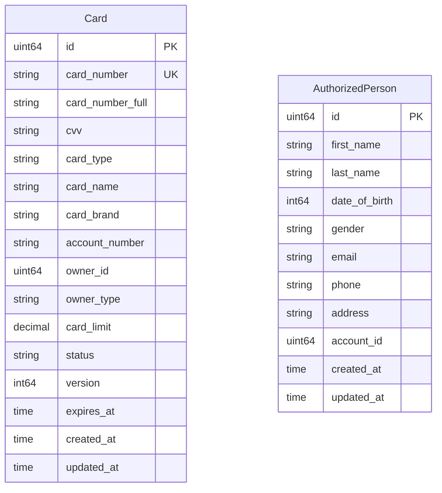

# card_db — ER Diagram

PostgreSQL, port 5436

> **Cross-DB references** (not enforced by FK constraints):
> - `Card.account_number` → `account_db.accounts.account_number`
> - `Card.owner_id` → `client_db.clients.id` (when owner_type = "client") or `card_db.authorized_persons.id` (when owner_type = "authorized_person")
> - `AuthorizedPerson.account_id` → `account_db.accounts.id`
