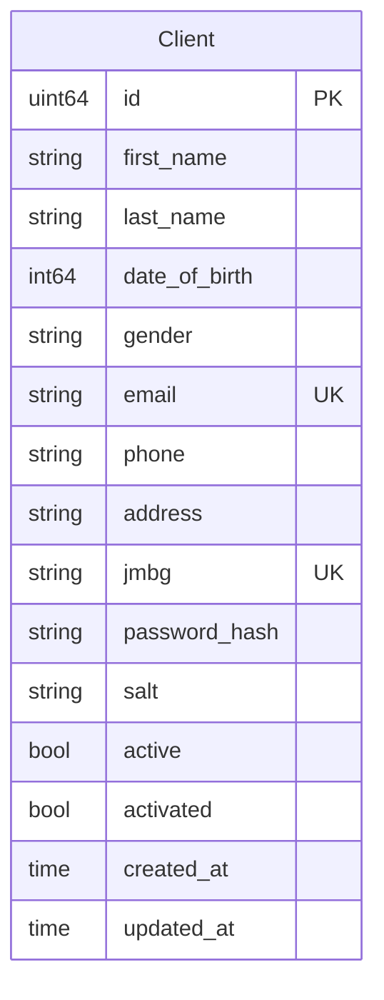

# client_db — ER Diagram

PostgreSQL, port 5434

> **Cross-DB references** (not enforced by FK constraints):
> - `Client.id` → `auth_db.refresh_tokens.user_id` (client refresh tokens)
> - `Client.id` → `auth_db.active_sessions.user_id` (client sessions)
