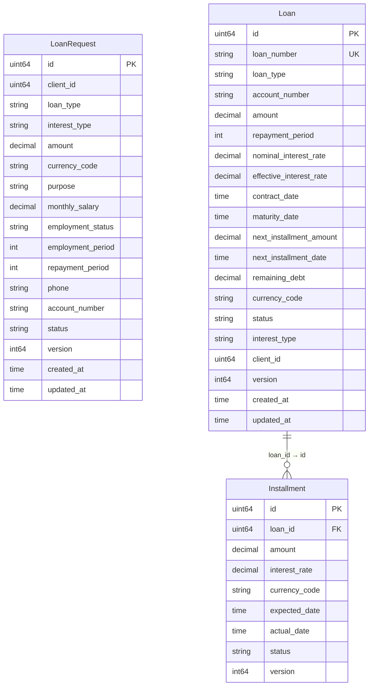

# credit_db — ER Diagram

PostgreSQL, port 5438

> **Cross-DB references** (not enforced by FK constraints):
> - `LoanRequest.client_id` → `client_db.clients.id`
> - `LoanRequest.account_number` → `account_db.accounts.account_number`
> - `Loan.client_id` → `client_db.clients.id`
> - `Loan.account_number` → `account_db.accounts.account_number`
