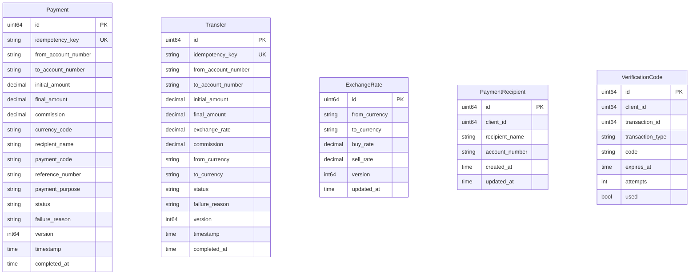

# transaction_db — ER Diagram

PostgreSQL, port 5437

> **Cross-DB references** (not enforced by FK constraints):
> - `Payment.from_account_number` / `to_account_number` → `account_db.accounts.account_number`
> - `Transfer.from_account_number` / `to_account_number` → `account_db.accounts.account_number`
> - `PaymentRecipient.client_id` → `client_db.clients.id`
> - `VerificationCode.client_id` → `client_db.clients.id`
> - `VerificationCode.transaction_id` → `transaction_db.payments.id` or `transaction_db.transfers.id`
