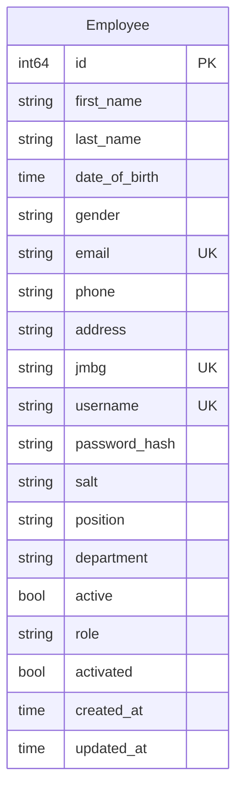

# user_db — ER Diagram

PostgreSQL, port 5432

```mermaid
erDiagram
    Employee {
        int64 id PK
        string first_name
        string last_name
        time date_of_birth
        string gender
        string email UK
        string phone
        string address
        string jmbg UK
        string username UK
        string password_hash
        string salt
        string position
        string department
        bool active
        string role
        bool activated
        time created_at
        time updated_at
    }
```
